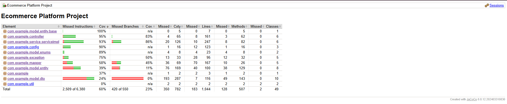
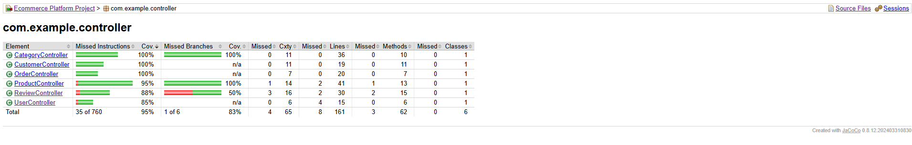
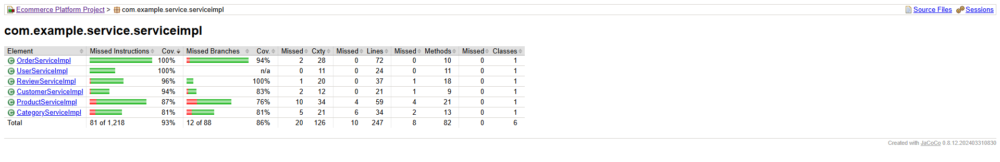

# E-commerce Management System

A comprehensive e-commerce management system built with Spring Boot framework.

## Project Structure

This project follows a layered architecture with the following package structure:

```
com.example
├── config/                 # Configuration classes
├── controller/            # REST Controllers
├── service/              # Service interfaces
├── serviceimpl/          # Service implementations
├── repository/           # Data access layer
├── model/
│   ├── entity/           # JPA entities
│   └── dto/              # Data Transfer Objects
├── exception/            # Custom exceptions
└── util/                 # Utility classes
```

## Technologies Used

- **Spring Boot 3.2.6** - Main framework
- **Spring Data JPA** - Data persistence
- **Oracle Database 21c** - Production database with OJDBC8 driver
- **HikariCP** - Connection pooling
- **Lombok** - Reduce boilerplate code
- **Maven 3.6+** - Build tool
- **JUnit 5** - Testing framework with MockMvc for integration tests
- **Swagger/OpenAPI** - API documentation
- **H2 Database** - Testing database

## Getting Started

### Prerequisites

- Java 17 or higher
- Maven 3.6+

### Running the Application

1. Clone the repository
2. Navigate to the project directory
3. Run the application:
   ```bash
   mvn spring-boot:run
   ```

The application will start on `http://localhost:8080`

### Database Configuration

#### Production Environment (Oracle)
- **Database Version**: Oracle 21c
- **JDBC Driver**: ojdbc8 (21.9.0.0)
- **Database URL**: `jdbc:oracle:thin:@localhost:1521:orcl`
- **Connection Pool**: HikariCP with optimized settings

#### Test Environment (H2)
- **Database**: H2 in-memory database
- **Mode**: Oracle compatibility mode
- **Schema**: Automatically created from JPA entities
- **Data**: Loaded from `data.sql` for testing

The application uses Hibernate as the JPA provider with the following features:
- Automatic schema generation
- Entity relationships with proper foreign key constraints
- Connection pooling with HikariCP
- Transaction management

### API Documentation

Once the application is running, you can access the API documentation at:
- **Swagger UI**: `http://localhost:8080/swagger-ui.html`

## API Testing with Postman

### Setting Up Postman Collection

This project includes comprehensive Postman collections for testing all API endpoints.

#### 1. Available Collections

**🔵 User API Tests**: `ecommerce-user-api-tests.postman_collection.json`
- Complete User CRUD operations
- User validation and error handling

**🟢 Full API Tests**: `ecommerce-full-api-tests.postman_collection.json`
- Complete end-to-end testing
- Users, Products, Categories, and Orders
- Advanced search functionality
- Stock management testing

#### 2. Import the Collection

1. **Download Postman**: Install [Postman](https://www.postman.com/downloads/) if you haven't already
2. **Import Collection**: 
   - Open Postman
   - Click "Import" button
   - Select the file: `ecommerce-full-api-tests.postman_collection.json`
   - Click "Import"

#### 3. Environment Setup

The collection uses environment variables for flexibility:

1. **Create Environment**:
   - Click on "Environments" in the left sidebar
   - Click "Create Environment"
   - Name it "Ecommerce Local"

2. **Set Variables**:
   ```
   Variable Name: baseUrl
   Initial Value: http://localhost:8080
   Current Value: http://localhost:8080
   ```

3. **Select Environment**: Choose "Ecommerce Local" from the environment dropdown

#### 4. Full Collection Features

The comprehensive Postman collection includes tests for:

**✅ Setup & Test Data Creation:**
- Category creation (Electronics, Clothing)
- User and Customer profile creation
- Dynamic ID management

**✅ Product Management:**
- Product creation with category assignment
- Product retrieval (all products, by ID)
- Product updates and deletions
- Stock management operations

**✅ Advanced Product Search:**
- Keyword-based search
- Category filtering
- Price range filtering
- Combined filter searches
- Empty result handling

**✅ Order Management:**
- Successful order placement
- Multi-item orders
- Stock verification and updates
- Insufficient stock error handling
- Order retrieval and status management
- Order cancellation with stock restoration

**✅ Analytics & Reporting:**
- Top 5 products by sales
- Product count by category
- Sales analytics

**✅ Error Handling & Validation:**
- InsufficientStockException testing
- Comprehensive error response validation
- Stock management edge cases

**✅ Legacy User API Tests:**
- Valid user creation with different roles (EMPLOYEE, ADMIN, MANAGER)
- Password validation (required, minimum 8 characters)
- Email format validation
- Name length validation
- Role requirement validation

**✅ User Retrieval Tests:**
- Get all users with pagination
- Get user by ID (existing and non-existent)
- Verify masked password in responses

**✅ User Update Tests:**
- Valid user updates
- Validation error handling
- Non-existent user handling

**✅ User Deletion Tests:**
- Successful deletion
- Verification of deletion
- Non-existent user deletion

**✅ Error Response Validation:**
- Enhanced error structure with timestamp, status, error, message, and details
- Proper HTTP status codes (200, 201, 400, 404, 500)
- Validation error details

#### 5. Running the Tests

**Option 1: Run Entire Collection**
1. Right-click on the collection name
2. Select "Run collection"
3. Click "Run Ecommerce Platform - Full API Tests"
4. View test results and assertions

**Option 2: Run Individual Requests**
1. Expand any folder (Setup, Product Management, Order Management, etc.)
2. Click on any request to run it individually
3. Check the "Test Results" tab for assertions

#### 6. Test Data Management

The collection automatically:
- **Creates test data**: Categories, products, users, customers
- **Uses dynamic data**: Subsequent tests use stored IDs
- **Manages stock**: Tracks inventory changes
- **Cleans up**: Test data is deleted at the end
- **Validates responses**: Each test includes multiple assertions

#### 7. API Examples

**Create Product:**
```json
POST /api/v1/products
{
  "name": "Gaming Laptop",
  "description": "High-performance gaming laptop",
  "price": 1299.99,
  "stock": 10,
  "category": {
    "id": 1
  }
}
```

**Advanced Product Search:**
```http
GET /api/v1/products/search/advanced?keyword=laptop&categoryId=1&minPrice=500&maxPrice=2000
```

**Place Order:**
```json
POST /api/v1/orders
{
  "userId": 1,
  "customerId": 1,
  "orderItems": [
    {
      "productId": 1,
      "quantity": 2
    },
    {
      "productId": 2,
      "quantity": 1
    }
  ]
}
```

**Create Review:**
```json
POST /api/v1/reviews?productId=1&customerId=1&rating=5&reviewContent=Great product!
```

**Error Response - Insufficient Stock:**
```json
{
  "timestamp": "2025-07-12T10:30:45.123",
  "status": 400,
  "error": "Insufficient Stock",
  "message": "Insufficient stock for product 'Gaming Laptop'. Available: 5, Requested: 10",
  "details": "The requested quantity exceeds available stock"
}
```

#### 8. Collection Structure

```
📁 Ecommerce Platform - Full API Tests
├── 📁 Setup - Create Test Data
│   ├── 🟢 Create Category - Electronics
│   ├── 🟢 Create Category - Clothing
│   ├── 🟢 Create User - Customer
│   └── � Create Customer Profile
├── 📁 Product Management
│   ├── � Create Product - Laptop
│   ├── 🟢 Create Product - Smartphone
│   ├── � Create Product - T-Shirt
│   ├── � Create Product - Limited Stock Item
│   ├── 🔵 Get All Products
│   └── 🔵 Get Product by ID
├── 📁 Advanced Product Search
│   ├── � Search - Keyword Only
│   ├── 🔍 Search - Category Filter
│   ├── 🔍 Search - Price Range
│   ├── � Search - Combined Filters
│   └── 🔍 Search - No Results
├── 📁 Order Management
│   ├── 🔵 Check Initial Stock
│   ├── � Place Order - Success
│   ├── 🔍 Verify Stock Decreased
│   ├── � Place Order - Multiple Items
│   ├── 🔴 Attempt Order - Insufficient Stock
│   ├── 🔵 Get Order by ID
│   ├── 🔵 Get All Orders
│   ├── � Cancel Order
│   └── 🔍 Verify Stock Restored
├── 📁 Analytics and Reporting
│   ├── � Get Top 5 Products by Sales
│   └── 📊 Count Products by Category
└── 📁 Cleanup
    ├── 🔴 Delete Test Products
    ├── 🔴 Delete Test Customer
    └── 🔴 Delete Test User
```

Legend: 🟢 Create | 🔵 Read | 🟡 Update | 🔴 Delete | 🔍 Search | 📊 Analytics | 🧹 Cleanup

## API Endpoints

### User Management APIs
- **POST** `/api/v1/users` - Create a new user
- **GET** `/api/v1/users` - Get all users (paginated)
- **GET** `/api/v1/users/{id}` - Get user by ID
- **PUT** `/api/v1/users/{id}` - Update user
- **DELETE** `/api/v1/users/{id}` - Delete user

### Product Management APIs
- **POST** `/api/v1/products` - Create a new product
- **GET** `/api/v1/products` - Get all products (paginated)
- **GET** `/api/v1/products/{id}` - Get product by ID
- **PUT** `/api/v1/products/{id}` - Update product
- **DELETE** `/api/v1/products/{id}` - Delete product

### Advanced Product Search APIs
- **GET** `/api/v1/products/search/advanced` - Advanced search with filters
  - Query Parameters: `keyword`, `categoryId`, `minPrice`, `maxPrice`, `page`, `size`
- **GET** `/api/v1/products/search` - Simple keyword search
  - Query Parameters: `keyword`, `maxPrice`, `page`, `size`

### Product Analytics APIs
- **GET** `/api/v1/products/top5-by-sales` - Get top 5 products by sales amount
- **GET** `/api/v1/products/count-by-category/{categoryId}` - Count products by category

### Stock Management APIs
- **PUT** `/api/v1/products/{id}/stock` - Update product stock
  - Query Parameters: `stock`
- **GET** `/api/v1/products/{id}/stock/check` - Check stock availability
  - Query Parameters: `quantity`

### Order Management APIs
- **POST** `/api/v1/orders` - Place a new order
  - Request Body: `OrderRequestDTO` with `userId`, `customerId`, and `orderItems`
- **GET** `/api/v1/orders` - Get all orders
- **GET** `/api/v1/orders/{id}` - Get order by ID
- **PUT** `/api/v1/orders/{id}/cancel` - Cancel order
- **GET** `/api/v1/orders/user/name/{userName}` - Get orders by user name
- **GET** `/api/v1/orders/status/{status}` - Get orders by status

### Category Management APIs
- **POST** `/api/v1/categories` - Create a new category
- **GET** `/api/v1/categories` - Get all categories
- **GET** `/api/v1/categories/{id}` - Get category by ID
- **PUT** `/api/v1/categories/{id}` - Update category
- **DELETE** `/api/v1/categories/{id}` - Delete category

### Hierarchical Category APIs
- **GET** `/api/v1/categories/root` - Get root categories (no parent)
- **GET** `/api/v1/categories/{id}/subcategories` - Get subcategories of a category
- **GET** `/api/v1/categories/{id}/exists` - Check if category exists

### Customer Management APIs
- **POST** `/api/v1/customers` - Create a new customer
- **GET** `/api/v1/customers` - Get all customers
- **GET** `/api/v1/customers/{id}` - Get customer by ID
- **GET** `/api/v1/customers/email/{email}` - Get customer by email
- **PUT** `/api/v1/customers/{id}` - Update customer
- **DELETE** `/api/v1/customers/{id}` - Delete customer

### Review Management APIs
- **POST** `/api/v1/reviews` - Create a new review
  - Query Parameters: `productId`, `customerId`, `rating`, `reviewContent` (optional)
- **GET** `/api/v1/reviews` - Get all reviews
- **GET** `/api/v1/reviews/{id}` - Get review by ID
- **PUT** `/api/v1/reviews/{id}` - Update review
  - Query Parameters: `rating`, `reviewContent` (optional)
- **DELETE** `/api/v1/reviews/{id}` - Delete review

### Review Query APIs
- **GET** `/api/v1/reviews/product/{productId}` - Get reviews by product ID
- **GET** `/api/v1/reviews/customer/{customerId}` - Get reviews by customer ID
- **GET** `/api/v1/reviews/rating/{rating}` - Get reviews by rating
- **GET** `/api/v1/reviews/product/{productId}/average-rating` - Get average rating for product
- **GET** `/api/v1/reviews/product/{productId}/count` - Get review count for product
- **GET** `/api/v1/reviews/product/{productId}/sorted` - Get reviews sorted by date (newest first)
- **GET** `/api/v1/reviews/customer/{customerId}/sorted` - Get customer reviews sorted by date
- **GET** `/api/v1/reviews/customer/{customerId}/product/{productId}/exists` - Check if customer reviewed product

## API Testing with Postman

### Updated Collection Features

The Postman collection has been updated to reflect the current API endpoints and includes:

#### 📁 Complete API Coverage
- **Setup Data Creation** - Automated test data setup with environment variables
- **Product Management** - Full CRUD operations with stock management
- **Customer Management** - Complete customer lifecycle operations
- **Order Management** - Order placement, tracking, and cancellation
- **Review Management** - Product reviews and rating system
- **Advanced Search** - Multi-criteria product search capabilities
- **Analytics** - Sales reporting and category statistics
- **Error Handling** - Comprehensive error response validation

#### 🔧 API Request Examples

**Order Request Body Structure:**
```json
{
  "userId": 1,
  "customerId": 1,
  "orderItems": [
    {
      "productId": 1,
      "quantity": 2
    }
  ]
}
```

**Review Creation:**
```
POST /api/v1/reviews?productId=1&customerId=1&rating=5&reviewContent=Excellent product!
```

**Stock Management:**
```
PUT /api/v1/products/1/stock?stock=25
GET /api/v1/products/1/stock/check?quantity=10
```

### Environment Variables
- `baseUrl` - API base URL (http://localhost:8080)
- `test_user_id` - Created user ID for testing
- `test_customer_id` - Created customer ID for testing
- `electronics_category_id` - Electronics category ID
- `clothing_category_id` - Clothing category ID
- Product IDs for various test products

## Features

### Core E-commerce Functionality
- **User Management**: Complete CRUD operations for users with role-based access
- **Product Catalog**: Comprehensive product management with categories and stock tracking
- **Hierarchical Categories**: Parent-child category relationships with circular reference prevention
- **Advanced Search**: Multi-criteria product search with keyword, category, and price filters
- **Inventory Management**: Real-time stock tracking, validation, and automatic updates
- **Order Processing**: Complete order lifecycle with stock management and cancellation
- **Customer Management**: Customer profile and relationship management with email lookup
- **Review System**: Product reviews with ratings, sorting, and analytics
- **Stock Management**: Dedicated stock update and availability checking APIs

### Review Management Features
- **Review Creation**: Customers can create reviews for products with ratings (1-5)
- **Review Analytics**: Average ratings and review counts per product
- **Review Queries**: Search by product, customer, or rating
- **Review Sorting**: Chronological sorting (newest first) for both product and customer reviews
- **Duplicate Prevention**: Check if customer has already reviewed a product
- **Review Updates**: Customers can update their existing reviews
- **Review Deletion**: Administrative review removal capabilities

### Technical Features
- **Password Security**: Secure password handling with masking in responses
- **Email Search**: Flexible customer search by email address
- **Role Management**: Support for ADMIN, MANAGER, EMPLOYEE, CUSTOMER_SERVICE roles
- **Data Validation**: Comprehensive input validation with detailed error messages
- **Transaction Management**: Oracle database with optimized connection pooling
- **Enhanced Error Handling**: Structured error responses with timestamps and details
- **Custom Exceptions**: InsufficientStockException for inventory management
- **API Documentation**: Interactive Swagger UI documentation
- **Comprehensive Testing**: Updated Postman collection with 50+ test scenarios
- **Database Integration**: Oracle database with Hibernate ORM and proper relationships

### Business Logic
- **Stock Validation**: Prevents overselling with real-time stock checks
- **Order Management**: Automatic stock deduction on order placement and restoration
- **Review Constraints**: Prevents duplicate reviews and ensures data integrity
- **Category Hierarchy**: Enforces proper parent-child relationships with validation
- **Circular Reference Prevention**: Validates category relationships to prevent infinite loops
- **Sales Analytics**: Top-selling products and category-wise reporting
- **Price Range Filtering**: Dynamic price-based product filtering
- **Multi-item Orders**: Support for complex orders with multiple products
- **Customer Analytics**: Track customer purchase history and review patterns

## Development and Testing

### Running Tests

To run the complete test suite including integration tests:

```bash
mvn clean test jacoco:report
```

This will:
1. Clean the project
2. Run all tests
3. Generate a JaCoCo code coverage report

The test coverage report will be available at:
`target/site/jacoco/index.html`

### Building the Project

To build the project:

```bash
mvn clean package
```

### Running with Different Profiles

The application supports multiple profiles:
- **dev** - Development profile with H2 database
- **prod** - Production profile with Oracle database

To run with a specific profile:

```bash
mvn spring-boot:run -Dspring-boot.run.profiles=dev
```

## Project Status

This project includes a fully functional E-commerce Management System with:

### ✅ Completed Modules

**User Management System:**
- ✅ Complete User CRUD Operations
- ✅ Role-based access control
- ✅ Password security and masking
- ✅ Email validation and search

**Product Management System:**
- ✅ Complete Product CRUD Operations
- ✅ Category management and assignment
- ✅ Advanced multi-criteria search
- ✅ Stock management and validation
- ✅ Price range filtering
- ✅ Stock update and availability checking APIs
- ✅ Top-selling products analytics

**Order Management System:**
- ✅ Complete Order lifecycle management
- ✅ Multi-item order processing with OrderRequestDTO
- ✅ Real-time stock validation
- ✅ Automatic stock deduction/restoration
- ✅ Order cancellation with stock recovery
- ✅ Order tracking by user name and status
- ✅ InsufficientStockException handling

**Customer Management System:**
- ✅ Complete Customer CRUD Operations
- ✅ Email-based customer lookup
- ✅ Customer profile management
- ✅ Customer-order relationship tracking

**Review Management System:**
- ✅ Complete Review CRUD Operations
- ✅ Product rating system (1-5 stars)
- ✅ Review analytics (average ratings, counts)
- ✅ Review sorting by date (newest first)
- ✅ Duplicate review prevention
- ✅ Multi-criteria review queries
- ✅ Customer review history tracking

**Analytics & Reporting:**
- ✅ Top-selling products analysis
- ✅ Category-wise product counting
- ✅ Sales amount calculations
- ✅ Product review analytics
- ✅ Customer engagement metrics

**Technical Infrastructure:**
- ✅ Oracle database integration with HikariCP
- ✅ Enhanced error handling with structured responses
- ✅ Comprehensive data validation
- ✅ Transaction management
- ✅ API documentation with Swagger
- ✅ Updated Postman collection with 70+ test scenarios
- ✅ Complete entity relationships and foreign keys

### 🚀 Key Business Features

- **Inventory Management**: Real-time stock tracking prevents overselling with dedicated stock APIs
- **Order Processing**: Seamless order-to-fulfillment workflow with proper DTOs and validation
- **Search & Discovery**: Advanced product search with multiple filters and analytics
- **Customer Management**: Complete customer profile management with email lookup
- **Review System**: Comprehensive product review and rating system with analytics
- **Analytics**: Sales reporting, product performance metrics, and customer engagement data

**Production Ready**: The system is architected for scalability and includes comprehensive error handling, testing, and documentation. The updated Postman collection provides complete API coverage with automated testing scenarios.

## Updated Postman Collection Structure

The Postman collection has been updated to include all current API endpoints:

```
📁 E-commerce Platform - Full API Tests
├── 📁 Setup - Create Test Data
│   ├── 🟢 Create Category - Electronics
│   ├── 🟢 Create Category - Clothing  
│   ├── 🟢 Create User Profile
│   └── 🟢 Create Customer Profile
├── 📁 Product Management
│   ├── 🟢 Create Product - Laptop
│   ├── 🟢 Create Product - Smartphone
│   ├── 🟢 Create Product - T-Shirt
│   ├── 🟢 Create Product - Limited Stock Item
│   ├── 🔵 Get All Products
│   ├── 🔵 Get Product by ID
│   ├── 🟡 Update Product Stock
│   └── 🔵 Check Product Stock
├── 📁 Customer Management
│   ├── 🔵 Get All Customers
│   ├── 🔵 Get Customer by ID
│   ├── 🔵 Get Customer by Email
│   └── 🟡 Update Customer
├── 📁 Advanced Product Search
│   ├── 🔍 Search - Keyword Only
│   ├── 🔍 Search - Category Filter
│   ├── 🔍 Search - Price Range
│   ├── 🔍 Search - Combined Filters
│   └── 🔍 Search - No Results
├── 📁 Order Management
│   ├── 🔵 Check Initial Stock
│   ├── 🟢 Place Order - Success
│   ├── 🔵 Verify Stock Decreased
│   ├── 🟢 Place Order - Multiple Items
│   ├── 🔴 Attempt Order - Insufficient Stock
│   ├── 🔵 Get Order by ID
│   ├── 🔵 Get All Orders
│   ├── 🔵 Get Orders by User Name
│   ├── 🔵 Get Orders by Status
│   ├── 🟡 Cancel Order
│   └── 🔵 Verify Stock Restored
├── 📁 Review Management
│   ├── 🟢 Create Review - Laptop
│   ├── 🟢 Create Review - Smartphone
│   ├── 🔵 Get All Reviews
│   ├── 🔵 Get Review by ID
│   ├── 🔵 Get Reviews by Product ID
│   ├── 🔵 Get Reviews by Customer ID
│   ├── 🔵 Get Reviews by Rating
│   ├── 🔵 Get Average Rating for Product
│   ├── 🔵 Get Review Count for Product
│   ├── 🟡 Update Review
│   ├── 🔵 Check if Customer has Reviewed Product
│   ├── 🔵 Get Reviews Sorted by Date
│   ├── 🔵 Get Reviews by Customer (Sorted)
│   └── 🔴 Delete Review
├── 📁 Analytics and Reporting
│   ├── 📊 Get Top 5 Products by Sales
│   └── 📊 Count Products by Category
└── 📁 Cleanup
    ├── 🔴 Delete Test Products
    ├── 🔴 Delete Test Customer
    ├── 🔴 Delete Test Reviews
    └── 🔴 Delete Test User
```

Legend: 🟢 Create | 🔵 Read | 🟡 Update | 🔴 Delete | 🔍 Search | 📊 Analytics | 🧹 Cleanup

## Code Coverage Report

### Overall Project Coverage


The project maintains a strong overall test coverage:
- **Total Coverage**: 60% of 6,380 instructions
- **Branch Coverage**: 23% (420 of 550 branches)
- **Line Coverage**: ~78% (1,044 lines covered)
- **Method Coverage**: ~99% (507 methods covered)
- **Class Coverage**: 100% (49 classes covered)

### Controller Layer Coverage


Controller layer shows excellent test coverage:
- **CategoryController**: 100% instruction coverage, 100% branch coverage
- **CustomerController**: 100% instruction coverage
- **OrderController**: 100% instruction coverage
- **ProductController**: 95% instruction coverage, 100% branch coverage
- **ReviewController**: 88% instruction coverage, 50% branch coverage
- **UserController**: 85% instruction coverage

Total controller layer metrics:
- **Instruction Coverage**: 95%
- **Branch Coverage**: 83%
- **Method Coverage**: 100% (62 methods)
- **Class Coverage**: 100% (6 classes)

### Service Layer Coverage


Service implementation layer demonstrates robust testing:
- **OrderServiceImpl**: 100% instruction coverage, 94% branch coverage
- **UserServiceImpl**: 100% instruction coverage
- **ReviewServiceImpl**: 96% instruction coverage, 100% branch coverage
- **CustomerServiceImpl**: 94% instruction coverage, 83% branch coverage
- **ProductServiceImpl**: 87% instruction coverage, 76% branch coverage
- **CategoryServiceImpl**: 81% instruction coverage, 81% branch coverage

Total service layer metrics:
- **Instruction Coverage**: 93%
- **Branch Coverage**: 86%
- **Line Coverage**: 247 lines covered
- **Method Coverage**: 100% (82 methods)
- **Class Coverage**: 100% (6 classes)

### Areas for Improvement
1. **Data Transfer Objects**: Current coverage at 24% - needs additional testing for DTO mappings
2. **Exception Handling**: 75% coverage - could be improved with more edge case testing
3. **Branch Coverage**: Overall 23% - could be enhanced by adding more conditional test cases

### Key Achievements
1. Perfect class coverage across all layers
2. High method coverage (99%+) indicating thorough testing of functionality
3. Strong controller layer coverage (95%) ensuring API endpoint reliability
4. Robust service layer coverage (93%) validating business logic implementation
